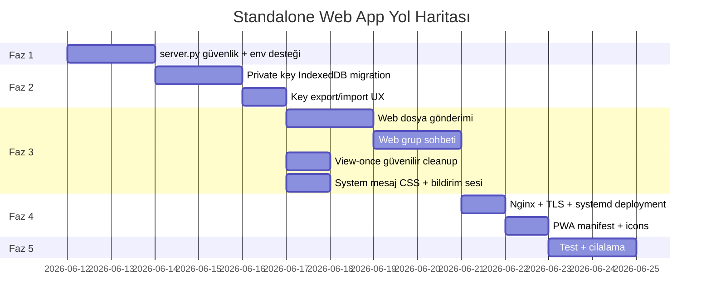

# HybridP2P Messenger — Durum Değerlendirmesi & Standalone Web App Planı

> **Tarih:** 2026-06-10

---

## Bölüm A: Mevcut Uygulamada Eksik / Geliştirilmesi Gereken Şeyler

### 🔴 Kritik — Kullanıcı Deneyimini Doğrudan Etkileyen

| # | Sorun | Açıklama |
|---|-------|----------|
| 1 | **Ephemeral mod cross-client sync** | Desktop'tan ephemeral açınca web bilgilendiriliyor (az önce düzelttik) ama **sunucu tarafında `chat_settings` tablosuna yazmıyor** web client. Desktop'un `sync_chat_settings()` ile açılışta çektiği state güncellenmemiş oluyor. Sunucu restart sonrası state kaybolur. |
| 2 | **Gönderilen mesajda ephemeral koruması** | Web'de `sendMessage()` her zaman `saveChatToLocalStorage()` çağırıyor — kendi gönderdiğin mesajlar ephemeral olsa bile localStorage'a yazılıyor. Sadece gelen mesajları düzelttik. |
| 3 | **Secret key backup/restore UX** | Sign out yapınca private key kayboluyor, geri giriş imkansız. Anahtar dışa aktarma/import akışı yok. Şu an sadece ilk girişte üretiliyor ama kullanıcıya "bunu sakla" uyarısı yeterince belirgin değil. |

### 🟡 Orta — Fonksiyonel Eksikler

| # | Sorun | Açıklama |
|---|-------|----------|
| 4 | **Web'de dosya/resim gönderimi yok** | Desktop client dosya gönderebilir, web client yalnızca metin gönderir. `file_message` WS tipi web'de handle edilmiyor. |
| 5 | **Web'de grup desteği yok** | Desktop'ta grup oluşturma/mesajlaşma var, web client'ta grup UI'ı ve `group_message` / `group_key_dist` WS handler'ları yok. |
| 6 | **Web'de arama (search) yok** | Desktop'ta inbox search var, web'de yalnızca basit chat listesi render ediliyor, filtreleme/mesaj içi arama yok. |
| 7 | **Web'de view-once mesaj alımı** | Gelen view-once mesajlar web'de görünüyor ama decrypt + self-destruct akışı kısmen var — countdown ve mesaj silme güvenilir değil (sayfa yenilenince mesaj localStorage'da kalıyor). |
| 8 | **Okundu bilgisi (Read Receipt)** | Ne desktop ne web'de "okundu" tiki var. Mesaj iletildi/saklandı ACK'ı var ama "görüldü" durumu yok. |
| 9 | **"Yazıyor..." göstergesi** | Hiçbir platformda typing indicator yok. |

### 🟢 Düşük — Cilalama / Polish

| # | Sorun | Açıklama |
|---|-------|----------|
| 10 | **Web UI'da system mesaj stili** | `appendSystemMessage()` fonksiyonu `msg-system-bubble` class'ını kullanıyor ama bu class CSS'te tanımlı değil — görsel olarak düz metin gibi çıkıyor. |
| 11 | **Desktop Tab hatası (ElevatedButton deprecation)** | Flet 0.85.x uyarıları devam ediyor (cosmetic). |
| 12 | **Mesaj tarih ayracı** | "Bugün", "Dün", "12 Haziran" gibi gün gruplandırması yok. |
| 13 | **Bildirim sesi** | Yeni mesaj geldiğinde ses efekti yok. |
| 14 | **Profil fotoğrafı** | Sadece baş harf avatarları var, gerçek fotoğraf yükleme yok. |

### ✅ Çalışan Şeyler (İster Karşılaması)

| Özellik | Desktop | Web |
|---------|---------|-----|
| E2EE mesajlaşma (RSA + AES-GCM) | ✅ | ✅ |
| WebSocket gerçek zamanlı | ✅ | ✅ |
| REST fallback | ✅ | ✅ |
| Offline mesaj biriktirme | ✅ | ✅ |
| TOFU key verification | ✅ | ✅ (web otomatik kabul) |
| Ephemeral mode toggle | ✅ | ✅ (yeni düzeltildi) |
| View-once mesaj gönderme | ✅ | ✅ |
| Dosya/resim gönderimi | ✅ | ❌ |
| Grup sohbeti | ✅ | ❌ |
| Online/Offline durumu | ✅ | ✅ |
| Chat inbox listesi | ✅ | ✅ |
| Mesaj arama | ✅ | ❌ |
| Server status göstergesi | ✅ | ✅ |
| Secret key backup | kısmen | kısmen |

---

## Bölüm B: Standalone Web App Planı (WhatsApp Web Modeli)

### Hedef

Kullanıcılar herhangi bir tarayıcıdan `https://mesaj.example.com` adresine gidip, masaüstü uygulaması kurmadan tam özellikli E2EE mesajlaşma yapabilecek. Server.py uzak bir VPS'te çalışır, web app oradan sunulur.

### Mimari Genel Bakış

```
┌──────────────────────────────────────────────────────────┐
│                     VPS / Cloud Server                    │
│                                                          │
│  ┌──────────────┐      ┌──────────────────────┐          │
│  │  Nginx/Caddy │─────▶│     server.py         │          │
│  │  (Reverse    │      │  FastAPI + Uvicorn    │          │
│  │   Proxy)     │      │  ┌────────────────┐   │          │
│  │              │      │  │  /ws/{user}     │   │          │
│  │  TLS/HTTPS   │      │  │  /api/*         │   │          │
│  │  WSS://      │      │  │  /static/*      │   │          │
│  │              │      │  └────────────────┘   │          │
│  │              │      │  ┌────────────────┐   │          │
│  │              │      │  │ relay_server.db │   │          │
│  │              │      │  │ encrypted_files/│   │          │
│  │              │      │  └────────────────┘   │          │
│  └──────────────┘      └──────────────────────┘          │
└──────────────────────────────────────────────────────────┘
          ▲                       ▲                 ▲
          │ HTTPS                 │ WSS             │ HTTPS
     ┌────┴─────┐           ┌────┴─────┐      ┌────┴─────┐
     │ Browser  │           │ Browser  │      │ Desktop  │
     │ (Alice)  │           │ (Bob)    │      │ client.py│
     │ Web App  │           │ Web App  │      │ (Carol)  │
     └──────────┘           └──────────┘      └──────────┘
```

### Faz 1: Sunucu Tarafı Hazırlık (1-2 gün)

#### 1.1 — server.py Değişiklikleri

| Değişiklik | Açıklama |
|------------|----------|
| `CORS origins` | `*` yerine explicit domain listesi veya environment variable |
| `ALLOWED_HOSTS` | Sadece bilinen domain'leri kabul et |
| **Rate limiting** | `slowapi` veya custom middleware — kayıt, mesaj gönderme, anahtar sorgulama endpoint'lerine limit |
| **HTTPS-only cookie flag** | Session/token varsa Secure + SameSite=Strict |
| **Health endpoint** | `GET /health` → uptime, DB durumu, aktif bağlantı sayısı |

#### 1.2 — Statik Dosya Stratejisi

Şu anda `server.py` direkt `static/` klasöründen serve ediyor. VPS'te iki seçenek:

**Seçenek A — Aynı süreç (Basit):**
```
server.py → StaticFiles("/", "static/")
```
Şu an böyle çalışıyor. Küçük/orta ölçek için yeterli.

**Seçenek B — Nginx reverse proxy (Önerilen):**
```nginx
server {
    listen 443 ssl;
    server_name mesaj.example.com;
    
    ssl_certificate     /etc/letsencrypt/live/mesaj.example.com/fullchain.pem;
    ssl_certificate_key /etc/letsencrypt/live/mesaj.example.com/privkey.pem;
    
    # Statik dosyalar doğrudan Nginx'ten
    location /static/ {
        alias /opt/hybridp2p/static/;
        expires 1h;
    }
    
    location / {
        root /opt/hybridp2p/static/;
        try_files $uri $uri/ /index.html;
    }
    
    # API ve WebSocket reverse proxy
    location /api/ {
        proxy_pass http://127.0.0.1:8000;
        proxy_set_header Host $host;
        proxy_set_header X-Real-IP $remote_addr;
    }
    
    location /ws/ {
        proxy_pass http://127.0.0.1:8000;
        proxy_http_version 1.1;
        proxy_set_header Upgrade $http_upgrade;
        proxy_set_header Connection "upgrade";
        proxy_read_timeout 86400;
    }
}
```

### Faz 2: Web App Güvenlik Katmanı (2-3 gün)

#### 2.1 — Private Key Yönetimi (En Kritik Konu)

Tarayıcıda private key güvenliği masaüstünden çok farklı. Strateji:

```
┌─────────────────────────────────────────────────────┐
│  Üretim:  Web Crypto API (SubtleCrypto)             │
│           → Anahtar tarayıcıda üretilir              │
│           → Sunucu ASLA private key görmez            │
│                                                      │
│  Saklama:  IndexedDB (non-extractable key)           │
│           + Opsiyonel: Parola ile AES-şifreli PEM    │
│             export → indirilebilir backup dosyası     │
│                                                      │
│  Taşıma:  Şifreli PEM dosyası import/export          │
│           → Başka tarayıcıda/cihazda giriş            │
└─────────────────────────────────────────────────────┘
```

**Mevcut Durum:** Web client zaten `window.crypto.subtle` kullanarak RSA-OAEP key pair üretiyor ve PEM'e çevirip localStorage'da saklıyor. Bu iyi bir başlangıç.

**Geliştirilecek:**
1. `IndexedDB` kullan (localStorage XSS'e daha açık)
2. Key export'u kullanıcının belirlediği parola ile AES-256-GCM encrypt et
3. Giriş ekranında "Import Key" butonu → şifreli PEM dosyasını yükle + parola gir
4. Logout'ta `sessionStorage`'daki session bilgisini temizle ama `IndexedDB`'deki encrypted key'i koru

#### 2.2 — CSP (Content Security Policy)

```html
<meta http-equiv="Content-Security-Policy" 
      content="default-src 'self'; 
               connect-src 'self' wss://mesaj.example.com; 
               script-src 'self' 'unsafe-inline'; 
               style-src 'self' 'unsafe-inline' https://fonts.googleapis.com; 
               font-src https://fonts.gstatic.com;">
```

#### 2.3 — Session Yönetimi

```
Login → Kullanıcı adı girer
     → Local key pair yüklenir (IndexedDB) veya üretilir
     → /api/register çağrılır (public key kaydı)
     → WebSocket bağlantısı kurulur (challenge-response auth)
     → Session state: sessionStorage'da (tab kapanınca temizlenir)
     → Chat geçmişi: IndexedDB'de (kalıcı, encrypted)
```

### Faz 3: Web App Feature Parity (3-5 gün)

Mevcut `static/index.html`'yi tam özellikli hale getirmek:

| Özellik | Mevcut Durum | Yapılacak İş |
|---------|-------------|-------------|
| Dosya/resim gönderimi | ❌ | File input + Web Crypto AES encrypt + upload API |
| Grup sohbeti | ❌ | Grup UI + WS group_message handler + symmetric key mgmt |
| Mesaj arama | ❌ | Local search over in-memory chat state |
| View-once (güvenilir) | Kısmen | Sayfa yenilemesinde temizleme + IndexedDB'den silme |
| System mesaj CSS | ❌ | `.msg-system-bubble` CSS class ekleme |
| Bildirim sesi | ❌ | `new Audio()` ile ping sesi |
| Okundu bilgisi | ❌ | `read_receipt` WS mesaj tipi ekleme (server + web + desktop) |

### Faz 4: Deployment (1 gün)

#### 4.1 — VPS Kurulum Scripti

```bash
#!/bin/bash
# deploy.sh — VPS'e HybridP2P Messenger kurulumu

# 1. Sistem hazırlığı
apt update && apt install -y python3.11 python3.11-venv nginx certbot python3-certbot-nginx

# 2. Proje klonlama
cd /opt
git clone https://github.com/erkinavcii/HybridP2P-Messenger.git
cd HybridP2P-Messenger

# 3. Python ortamı
python3.11 -m venv venv
source venv/bin/activate
pip install -r requirements.txt

# 4. Systemd service
cat > /etc/systemd/system/hybridp2p.service << 'EOF'
[Unit]
Description=HybridP2P Messenger Server
After=network.target

[Service]
Type=simple
User=www-data
WorkingDirectory=/opt/HybridP2P-Messenger
ExecStart=/opt/HybridP2P-Messenger/venv/bin/python server.py
Restart=always
RestartSec=5

[Install]
WantedBy=multi-user.target
EOF

systemctl enable hybridp2p
systemctl start hybridp2p

# 5. Nginx + Let's Encrypt
# (nginx config dosyası yukarıdaki Faz 1.2 Seçenek B'den kopyalanır)
certbot --nginx -d mesaj.example.com
```

#### 4.2 — Ortam Değişkenleri

```bash
# .env dosyası (VPS'te)
HYBRIDP2P_HOST=0.0.0.0
HYBRIDP2P_PORT=8000
HYBRIDP2P_DB_PATH=/opt/HybridP2P-Messenger/relay_server.db
HYBRIDP2P_FILE_STORE=/opt/HybridP2P-Messenger/encrypted_files/
HYBRIDP2P_CORS_ORIGINS=https://mesaj.example.com
HYBRIDP2P_MAX_FILE_SIZE=52428800  # 50MB
```

#### 4.3 — server.py'ye ENV Desteği Ekleme

```python
import os
HOST = os.getenv("HYBRIDP2P_HOST", "0.0.0.0")
PORT = int(os.getenv("HYBRIDP2P_PORT", "8000"))
CORS_ORIGINS = os.getenv("HYBRIDP2P_CORS_ORIGINS", "*").split(",")
```

### Faz 5: Web App'e Özel Detaylar

#### 5.1 — URL Yapısı
```
https://mesaj.example.com/           → Login sayfası
https://mesaj.example.com/#/chat     → Ana chat ekranı (SPA, hash routing)
https://mesaj.example.com/#/settings → Ayarlar (key backup/import)
```

#### 5.2 — PWA (Progressive Web App) Desteği

```json
// manifest.json
{
  "name": "HybridP2P Messenger",
  "short_name": "P2P Chat",
  "start_url": "/",
  "display": "standalone",
  "background_color": "#09090b",
  "theme_color": "#8b5cf6",
  "icons": [
    { "src": "/static/icon-192.png", "sizes": "192x192", "type": "image/png" },
    { "src": "/static/icon-512.png", "sizes": "512x512", "type": "image/png" }
  ]
}
```

Bu sayede kullanıcılar tarayıcıdan "Ana ekrana ekle" yapabilir → native app gibi çalışır.

#### 5.3 — API URL Dinamikleştirme

Şu an web client'ta `API_URL` ve `WS_URL` sabit:

```javascript
// Mevcut:
const API_URL = `http://${window.location.hostname}:8000`;

// Standalone için:
const API_URL = window.location.origin;     // https://mesaj.example.com
const WS_URL  = API_URL.replace("http", "ws"); // wss://mesaj.example.com
```

Bu değişiklik **zaten şimdi yapılabilir** ve hem local hem production'da çalışır.

---

## Özet Yol Haritası



| Faz | Süre | Öncelik |
|-----|------|---------|
| Faz 1: Server güvenlik | 2 gün | Kritik |
| Faz 2: Key yönetimi | 3 gün | Kritik |
| Faz 3: Feature parity | 3-5 gün | Yüksek |
| Faz 4: Deployment | 1 gün | Yüksek |
| Faz 5: Polish | 2 gün | Orta |
| **Toplam** | **~2 hafta** | |

> [!IMPORTANT]
> En kritik karar noktası: **Private key yönetimi**. IndexedDB + parola-korumalı export/import akışı doğru kurulursa, geri kalan her şey teknik detay. Bu aynı zamanda "hesap taşıma" sorusunun da cevabı — kullanıcı şifreli key dosyasını başka cihaza taşıyarak aynı kimlikle giriş yapabilir.
