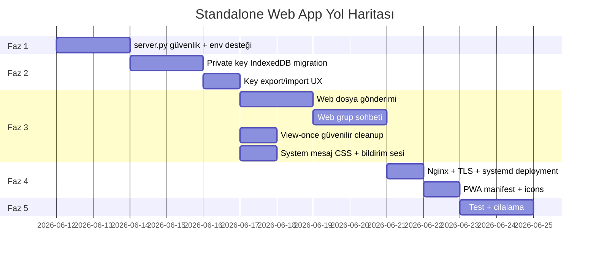
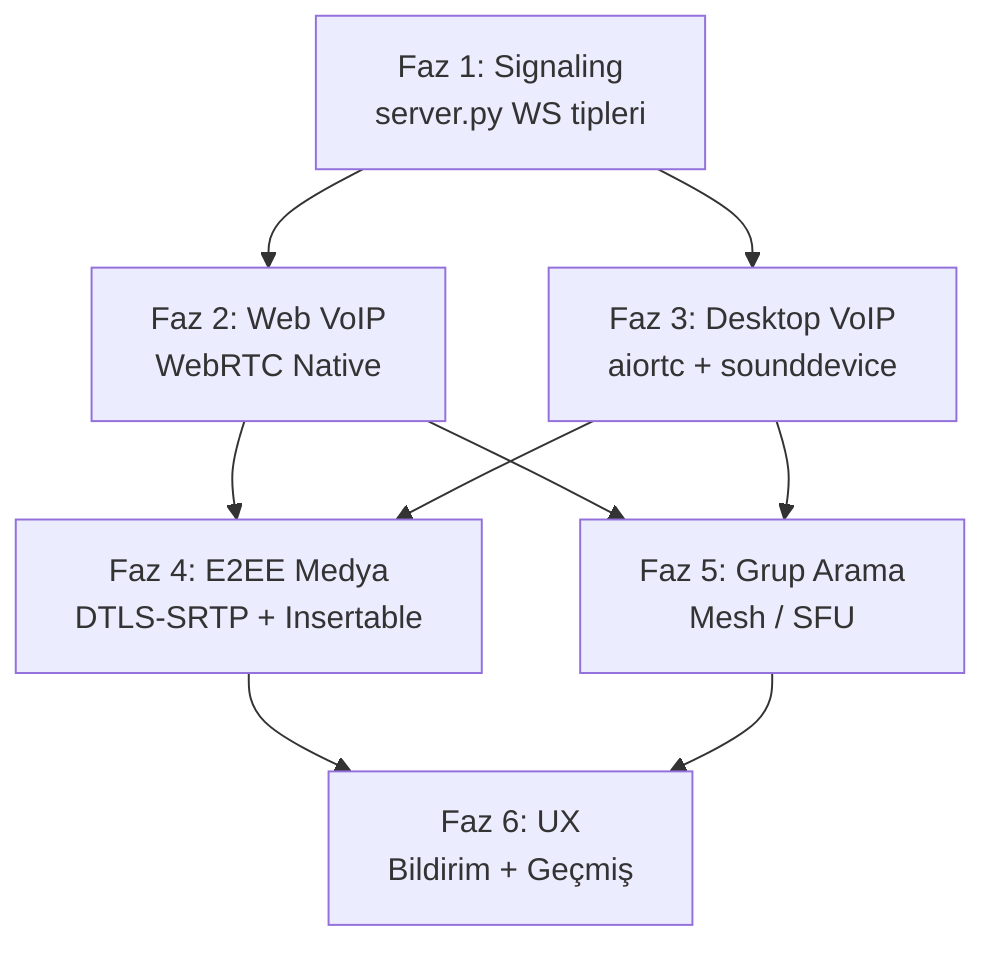

# HybridP2P Messenger — Durum Değerlendirmesi & Standalone Web App Planı

> **Tarih:** 2026-06-10

---

## Bölüm A: Mevcut Uygulamada Eksik / Geliştirilmesi Gereken Şeyler

### 🔴 Kritik — Kullanıcı Deneyimini Doğrudan Etkileyen

| # | Sorun | Açıklama |
|---|-------|----------|
| 1 | **Ephemeral mod cross-client sync** | ✅ Tamamlandı — Web arayüzünden Ephemeral modu açıp kapatıldığında sunucuya WebSocket ve REST fallback ile `ephemeral_toggle` mesajı gönderilerek `chat_settings` tablosunun güncellenmesi sağlandı. |
| 2 | **Gönderilen mesajda ephemeral koruması** | ✅ Tamamlandı — Sohbet ephemeral moddayken gönderilen veya alınan mesajların IndexedDB veritabanında saklanması engellendi. |
| 3 | **Secret key backup/restore UX** | ✅ Tamamlandı — Kullanıcıların özel anahtarlarını şifreli/şifresiz olarak yedekleyip içe aktarabilmesini (PEM import/export) sağlayan arayüz geliştirildi. |

### 🟡 Orta — Fonksiyonel Eksikler

| # | Sorun | Açıklama |
|---|-------|----------|
| 4 | **Web'de dosya/resim gönderimi** | ✅ Tamamlandı — RSA-OAEP + AES-GCM şifreli dosya/resim transferleri, inline resimler ve one-time view-once indirmeleri web istemcisinde çalışıyor. |
| 5 | **Web'de grup desteği yok** | ✅ Tamamlandı — Web istemcisine grup oluşturma, üye ekleme, grup mesajlaşma ve grup anahtarlarının dağıtımı (re-keying dahil) tamamen entegre edildi. |
| 6 | **Web'de arama (search) yok** | ✅ Tamamlandı — Web istemcisine hem sohbet odalarını hem de mesaj metinlerini filtreleyen global arama (search) özelliği eklendi. |
| 7 | **Web'de view-once mesaj alımı** | ✅ Tamamlandı — Sayfa yenilenmesinde veya modal kapatıldığında view-once mesaj ve dosyaları kalıcı olarak IndexedDB'den silinerek güvenli hale getirildi. |
| 8 | **Okundu bilgisi (Read Receipt)** | ✅ Tamamlandı — Çift yeşil tik okundu bilgisi desktop ve web için eklendi. |
| 9 | **"Yazıyor..." göstergesi** | Hiçbir platformda typing indicator yok. |

### 🟢 Düşük — Cilalama / Polish

| # | Sorun | Açıklama |
|---|-------|----------|
| 10 | **Web UI'da system mesaj stili** | ✅ Tamamlandı — `.msg-system-bubble` CSS kuralı styles.css dosyasına eklenerek sistem mesajlarının görünümü iyileştirildi. |
| 11 | **Desktop Tab hatası (ElevatedButton deprecation)** | Flet 0.85.x uyarıları devam ediyor (cosmetic). |
| 12 | **Mesaj tarih ayracı** | "Bugün", "Dün", "12 Haziran" gibi gün gruplandırması yok. |
| 13 | **Bildirim sesi** | Yeni mesaj geldiğinde ses efekti yok. |
| 14 | **Profil fotoğrafı** | Sadece baş harf avatarları var, gerçek fotoğraf yükleme yok. |

### ✅ Çalışan Şeyler (İster Karşılaması)

| Özellik | Desktop | Web |
|---------|---------|-----|
| E2EE mesajlaşma (RSA + AES-GCM) | ✅ | ✅ |
| WebSocket gerçek zamanlı | ✅ | ✅ |
| REST fallback | ✅ | ✅ |
| Offline mesaj biriktirme | ✅ | ✅ |
| TOFU key verification | ✅ | ✅ (web otomatik kabul) |
| Ephemeral mode toggle | ✅ | ✅ (yeni düzeltildi) |
| View-once mesaj gönderme | ✅ | ✅ |
| Dosya/resim gönderimi | ✅ | ✅ |
| Grup sohbeti | ✅ | ✅ |
| Online/Offline durumu | ✅ | ✅ |
| Chat inbox listesi | ✅ | ✅ |
| Mesaj arama | ✅ | ✅ |
| Server status göstergesi | ✅ | ✅ |
| Okundu bilgisi (çift yeşil tik) | ✅ | ✅ |
| Secret key backup | kısmen | ✅ |

---

## Bölüm B: Standalone Web App Planı (WhatsApp Web Modeli)

### Hedef

Kullanıcılar herhangi bir tarayıcıdan `https://mesaj.example.com` adresine gidip, masaüstü uygulaması kurmadan tam özellikli E2EE mesajlaşma yapabilecek. Server.py uzak bir VPS'te çalışır, web app oradan sunulur.

### Mimari Genel Bakış

```
┌──────────────────────────────────────────────────────────┐
│                     VPS / Cloud Server                    │
│                                                          │
│  ┌──────────────┐      ┌──────────────────────┐          │
│  │  Nginx/Caddy │─────▶│     server.py         │          │
│  │  (Reverse    │      │  FastAPI + Uvicorn    │          │
│  │   Proxy)     │      │  ┌────────────────┐   │          │
│  │              │      │  │  /ws/{user}     │   │          │
│  │  TLS/HTTPS   │      │  │  /api/*         │   │          │
│  │  WSS://      │      │  │  /static/*      │   │          │
│  │              │      │  └────────────────┘   │          │
│  │              │      │  ┌────────────────┐   │          │
│  │              │      │  │ relay_server.db │   │          │
│  │              │      │  │ encrypted_files/│   │          │
│  │              │      │  └────────────────┘   │          │
│  └──────────────┘      └──────────────────────┘          │
└──────────────────────────────────────────────────────────┘
          ▲                       ▲                 ▲
          │ HTTPS                 │ WSS             │ HTTPS
     ┌────┴─────┐           ┌────┴─────┐      ┌────┴─────┐
     │ Browser  │           │ Browser  │      │ Desktop  │
     │ (Alice)  │           │ (Bob)    │      │ client.py│
     │ Web App  │           │ Web App  │      │ (Carol)  │
     └──────────┘           └──────────┘      └──────────┘
```

### Faz 1: Sunucu Tarafı Hazırlık (1-2 gün)

#### 1.1 — server.py Değişiklikleri

| Değişiklik | Açıklama | Durum |
|------------|----------|-------|
| `CORS origins` | `*` yerine explicit domain listesi veya environment variable | ✅ Tamamlandı |
| `ALLOWED_HOSTS` | Sadece bilinen domain'leri kabul et | ✅ Tamamlandı |
| **Rate limiting** | `slowapi` veya custom middleware — kayıt, mesaj gönderme, anahtar sorgulama endpoint'lerine limit | ✅ Tamamlandı |
| **HTTPS-only cookie flag** | Session/token varsa Secure + SameSite=Strict | ➖ Uygulanamaz (İmza tabanlı auth) |
| **Health endpoint** | `GET /health` → uptime, DB durumu, aktif bağlantı sayısı | ✅ Tamamlandı |

#### 1.2 — Statik Dosya Stratejisi

Şu anda `server.py` direkt `static/` klasöründen serve ediyor. VPS'te iki seçenek:

**Seçenek A — Aynı süreç (Basit):**
```
server.py → StaticFiles("/", "static/")
```
Şu an böyle çalışıyor. Küçük/orta ölçek için yeterli.

**Seçenek B — Nginx reverse proxy (Önerilen):**
```nginx
server {
    listen 443 ssl;
    server_name mesaj.example.com;
    
    ssl_certificate     /etc/letsencrypt/live/mesaj.example.com/fullchain.pem;
    ssl_certificate_key /etc/letsencrypt/live/mesaj.example.com/privkey.pem;
    
    # Statik dosyalar doğrudan Nginx'ten
    location /static/ {
        alias /opt/hybridp2p/static/;
        expires 1h;
    }
    
    location / {
        root /opt/hybridp2p/static/;
        try_files $uri $uri/ /index.html;
    }
    
    # API ve WebSocket reverse proxy
    location /api/ {
        proxy_pass http://127.0.0.1:8000;
        proxy_set_header Host $host;
        proxy_set_header X-Real-IP $remote_addr;
    }
    
    location /ws/ {
        proxy_pass http://127.0.0.1:8000;
        proxy_http_version 1.1;
        proxy_set_header Upgrade $http_upgrade;
        proxy_set_header Connection "upgrade";
        proxy_read_timeout 86400;
    }
}
```

### Faz 2: Web App Güvenlik Katmanı (2-3 gün)

#### 2.1 — Private Key Yönetimi (En Kritik Konu)

Tarayıcıda private key güvenliği masaüstünden çok farklı. Strateji:

```
┌─────────────────────────────────────────────────────┐
│  Üretim:  Web Crypto API (SubtleCrypto)             │
│           → Anahtar tarayıcıda üretilir              │
│           → Sunucu ASLA private key görmez            │
│                                                      │
│  Saklama:  IndexedDB (non-extractable key)           │
│           + Opsiyonel: Parola ile AES-şifreli PEM    │
│             export → indirilebilir backup dosyası     │
│                                                      │
│  Taşıma:  Şifreli PEM dosyası import/export          │
│           → Başka tarayıcıda/cihazda giriş            │
└─────────────────────────────────────────────────────┘
```

**Mevcut Durum:** Web client zaten `window.crypto.subtle` kullanarak RSA-OAEP key pair üretiyor ve PEM'e çevirip localStorage'da saklıyor. Bu iyi bir başlangıç.

**Geliştirilecek:**
1. `IndexedDB` kullan (localStorage XSS'e daha açık) ✅ (Tamamlandı)
2. Key export'u kullanıcının belirlediği parola ile AES-256-GCM encrypt et ✅ (Tamamlandı)
3. Giriş ekranında "Import Key" butonu → şifreli PEM dosyasını yükle + parola gir ✅ (Tamamlandı)
4. Logout'ta `sessionStorage`'daki session bilgisini temizle ama `IndexedDB`'deki encrypted key'i koru ✅ (Tamamlandı)

#### 2.2 — CSP (Content Security Policy) ✅ (Tamamlandı)

```html
<meta http-equiv="Content-Security-Policy" 
      content="default-src 'self'; 
               connect-src 'self' wss://mesaj.example.com; 
               script-src 'self' 'unsafe-inline'; 
               style-src 'self' 'unsafe-inline' https://fonts.googleapis.com; 
               font-src https://fonts.gstatic.com;">
```

#### 2.3 — Session Yönetimi ✅ (Tamamlandı)

```
Login → Kullanıcı adı girer
     → Local key pair yüklenir (IndexedDB) veya üretilir
     → /api/register çağrılır (public key kaydı)
     → WebSocket bağlantısı kurulur (challenge-response auth)
     → Session state: sessionStorage'da (tab kapanınca temizlenir)
     → Chat geçmişi: IndexedDB'de (kalıcı, encrypted)
```

### Faz 3: Web App Feature Parity (3-5 gün)

Mevcut `static/index.html`'yi tam özellikli hale getirmek:

| Özellik | Mevcut Durum | Yapılacak İş |
|---------|-------------|-------------|
| Dosya/resim gönderimi | ❌ | File input + Web Crypto AES encrypt + upload API |
| Grup sohbeti | ❌ | Grup UI + WS group_message handler + symmetric key mgmt |
| Mesaj arama | ❌ | Local search over in-memory chat state |
| View-once (güvenilir) | Kısmen | Sayfa yenilemesinde temizleme + IndexedDB'den silme |
| System mesaj CSS | ❌ | `.msg-system-bubble` CSS class ekleme |
| Bildirim sesi | ❌ | `new Audio()` ile ping sesi |
| Okundu bilgisi | ✅ | Eklendi (server + web + desktop, çift yeşil tik okundu bilgisi) |

### Faz 4: Deployment (1 gün)

#### 4.1 — VPS Kurulum Scripti

```bash
#!/bin/bash
# deploy.sh — VPS'e HybridP2P Messenger kurulumu

# 1. Sistem hazırlığı
apt update && apt install -y python3.11 python3.11-venv nginx certbot python3-certbot-nginx

# 2. Proje klonlama
cd /opt
git clone https://github.com/erkinavcii/HybridP2P-Messenger.git
cd HybridP2P-Messenger

# 3. Python ortamı
python3.11 -m venv venv
source venv/bin/activate
pip install -r requirements.txt

# 4. Systemd service
cat > /etc/systemd/system/hybridp2p.service << 'EOF'
[Unit]
Description=HybridP2P Messenger Server
After=network.target

[Service]
Type=simple
User=www-data
WorkingDirectory=/opt/HybridP2P-Messenger
ExecStart=/opt/HybridP2P-Messenger/venv/bin/python server.py
Restart=always
RestartSec=5

[Install]
WantedBy=multi-user.target
EOF

systemctl enable hybridp2p
systemctl start hybridp2p

# 5. Nginx + Let's Encrypt
# (nginx config dosyası yukarıdaki Faz 1.2 Seçenek B'den kopyalanır)
certbot --nginx -d mesaj.example.com
```

#### 4.2 — Ortam Değişkenleri

```bash
# .env dosyası (VPS'te)
HYBRIDP2P_HOST=0.0.0.0
HYBRIDP2P_PORT=8000
HYBRIDP2P_DB_PATH=/opt/HybridP2P-Messenger/relay_server.db
HYBRIDP2P_FILE_STORE=/opt/HybridP2P-Messenger/encrypted_files/
HYBRIDP2P_CORS_ORIGINS=https://mesaj.example.com
HYBRIDP2P_MAX_FILE_SIZE=52428800  # 50MB
```

#### 4.3 — server.py'ye ENV Desteği Ekleme ✅ (Tamamlandı)

```python
import os
HOST = os.getenv("HYBRIDP2P_HOST", "0.0.0.0")
PORT = int(os.getenv("HYBRIDP2P_PORT", "8000"))
CORS_ORIGINS = os.getenv("HYBRIDP2P_CORS_ORIGINS", "*").split(",")
```

### Faz 5: Web App'e Özel Detaylar

#### 5.1 — URL Yapısı
```
https://mesaj.example.com/           → Login sayfası
https://mesaj.example.com/#/chat     → Ana chat ekranı (SPA, hash routing)
https://mesaj.example.com/#/settings → Ayarlar (key backup/import)
```

#### 5.2 — PWA (Progressive Web App) Desteği

```json
// manifest.json
{
  "name": "HybridP2P Messenger",
  "short_name": "P2P Chat",
  "start_url": "/",
  "display": "standalone",
  "background_color": "#09090b",
  "theme_color": "#8b5cf6",
  "icons": [
    { "src": "/static/icon-192.png", "sizes": "192x192", "type": "image/png" },
    { "src": "/static/icon-512.png", "sizes": "512x512", "type": "image/png" }
  ]
}
```

Bu sayede kullanıcılar tarayıcıdan "Ana ekrana ekle" yapabilir → native app gibi çalışır.

#### 5.3 — API URL Dinamikleştirme

Şu an web client'ta `API_URL` ve `WS_URL` sabit:

```javascript
// Mevcut:
const API_URL = `http://${window.location.hostname}:8000`;

// Standalone için:
const API_URL = window.location.origin;     // https://mesaj.example.com
const WS_URL  = API_URL.replace("http", "ws"); // wss://mesaj.example.com
```

Bu değişiklik **zaten şimdi yapılabilir** ve hem local hem production'da çalışır.

---

## Özet Yol Haritası



| Faz | Süre | Öncelik |
|-----|------|---------|
| Faz 1: Server güvenlik | 2 gün | Kritik |
| Faz 2: Key yönetimi | 3 gün | Kritik |
| Faz 3: Feature parity | 3-5 gün | Yüksek |
| Faz 4: Deployment | 1 gün | Yüksek |
| Faz 5: Polish | 2 gün | Orta |
| **Toplam** | **~2 hafta** | |

> [!IMPORTANT]
> En kritik karar noktası: **Private key yönetimi**. IndexedDB + parola-korumalı export/import akışı doğru kurulursa, geri kalan her şey teknik detay. Bu aynı zamanda "hesap taşıma" sorusunun da cevabı — kullanıcı şifreli key dosyasını başka cihaza taşıyarak aynı kimlikle giriş yapabilir.

---

## Bölüm C: Web İstemcisinde Grup Sohbeti (Group Chat) Desteği Detaylı Planı

Bu bölüm, web istemcisinde (`static/index.html`) grup sohbeti özelliğinin masaüstü istemcisiyle (`client.py`) ve sunucuyla (`server.py`) tam uyumlu şekilde çalışabilmesi için yapılması gereken adımları içerir. Kodlamaya başlamadan önce bu adımların onaylanması beklenmektedir.

### 1. Veri Yapısı ve Depolama (Storage & State)
- [x] **Grup Anahtarı Depolama Alanı:** `localStorage` üzerinde veya local state'de grup anahtarlarını saklamak için bir yapı kur.
  - Şema: `group_key_{group_id}` -> `Hex (AES Key)`.
- [x] **Chat Nesnesinde Grup Ayırımı:** `state.chats[partner]` nesnelerine `isGroup: true` bayrağı ekle. `group_` ile başlayan partner ID'lerini otomatik olarak grup olarak tanı.
- [x] **Kişi Listesi (Contacts) Genişletme:** `state.contacts` listesinde grupları da listele ve bunlara özel grup ikonları ata.

### 2. Arayüz (UI) Güncellemeleri
- [x] **Yeni Grup Oluşturma Arayüzü:** "New Chat" modal pencerisine "Grup Sohbeti Oluştur" sekmesi ekle.
  - Girdiler: Grup Adı (`Group Name`), Üyeler (`Members` - virgülle ayrılmış kullanıcı adları).
- [x] **Sol Sohbet Listesi (Inbox) Güncellemesi:** Gruplar için kişi ikonları yerine grup ikonları (`ft.Icons.GROUP` benzeri SVG) kullan.
- [x] **Grup Üst Bilgi Paneli (Chat Header):** Aktif sohbet bir grup olduğunda üst kısımda "Group: [Grup Adı]" yazdır ve gruptan çıkma (`Leave Group`) veya yeniden anahtarlama (`Rekey`) düğmelerini göster.
- [x] **Gönderen Bilgisi (Message Bubble):** Grup sohbetinde gelen mesaj balonlarında, mesajın sol üstünde gerçek göndericinin kullanıcı adını göster (kişisel sohbetlerde bu gizli kalır).

### 3. Grup Oluşturma ve Anahtar Dağıtımı (Key Distribution)
- [x] **Üye Public Key Sorgulama:** Grup oluşturulurken listedeki her üye için `/api/public_key/{username}` endpoint'ine istek atarak RSA public key'lerini al.
- [x] **Grup Anahtarı Üretimi:** Rastgele 256-bit (32 byte) kriptografik simetrik grup anahtarı üret.
- [x] **Key Wrapping (Şifreleme):** Üretilen grup anahtarını gruptaki her bir üyenin RSA public key'i ile Web Crypto API kullanarak şifrele (`encryptBytesJS` ile RSA-OAEP-256).
- [x] **REST API Grup Kaydı:** `/api/groups` adresine `POST` isteği at (grup kurucusu, grup adı, grup ID'si, üye listesi).
- [x] **WebSocket Üzerinden Anahtar Dağıtımı:** Gruptaki tüm üyelere WebSocket üzerinden `group_key_dist` tipinde mesaj gönder. Bu mesaj şunları içerir:
  - `recipient`: Üyenin kullanıcı adı
  - `group_id`: Yeni oluşturulan grubun ID'si
  - `encrypted_payload`: Üyenin RSA public key'i ile şifrelenmiş grup anahtarı

### 4. Gelen Grup Anahtarını Alma (Key Acquisition)
- [x] **WS group_key_dist İşleyicisi:** WebSocket dinleyicisine (`type === "group_key_dist"`) durumunu ekle.
- [x] **Key Unwrapping (Deşifreleme):** Gelen `encrypted_payload` verisini kullanıcının kendi RSA Private Key'i ile çöz.
- [x] **Yerel Kayıt:** Çözülen grup anahtarını yerel depoda (`group_key_{group_id}`) sakla ve sohbet listesine bu grubu ekle.

### 5. Grup Mesajı Gönderme (Encrypt & Sign)
- [x] **Simetrik Şifreleme:** Mesaj yazılıp gönderildiğinde, ilgili grubun anahtarını çek ve mesaj gövdesini AES-GCM 256 ile şifrele (`encryptBytesJS` / `encryptSymmetric`).
- [x] **Kriptografik İmza (RSA Signature):** Gönderici, mesajı taklit edilmesini önlemek amacıyla kendi RSA Private Key'i ile imzalar.
  - İmzalanacak veri formatı: `${username}:${group_id}:${encrypted_payload}`
- [x] **WS group_message Gönderimi:** WebSocket üzerinden `type: "group_message"`, `group_id`, `encrypted_payload` (şifreli veri) ve `signature` (imza) içeren paketi sunucuya yolla.

### 6. Gelen Grup Mesajını Deşifre Etme ve İmza Doğrulama (Decrypt & Verify)
- [x] **WS group_message İşleyicisi:** WebSocket dinleyicisine (`type === "group_message"`) durumunu ekle.
- [x] **İmza Doğrulama (Signature Verification):** Gönderen kişinin RSA public key'ini yerel rehberden (yoksa `/api/public_key/{sender}` üzerinden) çek ve gelen imzayı doğrula.
  - İmza geçersizse mesajı engelle ve güvenlik uyarısı ver.
- [x] **Simetrik Deşifreleme:** Doğrulanan mesajı yereldeki `group_key_{group_id}` anahtarı ile çöz ve ekranda göster.

### 7. Oturum Açılışında Grupları Senkronize Etme (Sync Groups)
- [x] **Grup Listesi Çekme:** Kullanıcı giriş yaptığında `/api/groups/{username}` endpoint'ine istek atarak dahil olduğu tüm grupları ve grup isimlerini çek, sohbet arayüzündeki inbox listesine ekle.
- [x] **Çevrimdışı Mesaj Kuyruğu:** Çevrimdışı mesajlar indirilirken (`/api/fetch_messages/{username}`) gelen grup anahtarı dağıtımlarını (`group_key_dist`) ve grup mesajlarını (`group_message`) normal mesajlar gibi çözüp yerel depoya kaydet.

---

## Bölüm D: VoIP (Sesli / Görüntülü Arama) Altyapı Planı

Bu bölüm, HybridP2P Messenger'a **uçtan uca şifreli, düşük gecikmeli ve düşük sunucu maliyetli** sesli ve görüntülü arama (VoIP) özelliği eklenmesi için detaylı planı içerir.

### Temel Mimari Kararlar

```
┌─────────────────────────────────────────────────────────────────────┐
│                         VoIP Mimarisi                                │
│                                                                      │
│  Sinyal (Signaling)    →  Mevcut WebSocket altyapısı (server.py)     │
│  Medya Aktarımı        →  WebRTC (P2P, tarayıcı + masaüstü)         │
│  NAT Geçişi            →  STUN (ücretsiz) + TURN (fallback)         │
│  Ses Codec             →  Opus (48kHz, adaptif bitrate)              │
│  Video Codec           →  VP8/VP9 veya H.264 (platform tercihi)     │
│  E2EE Medya            →  SRTP (WebRTC varsayılan) + DTLS-SRTP      │
│                                                                      │
│  Sunucu Maliyeti:  ~$0  (STUN ücretsiz, medya P2P)                  │
│  TURN Maliyeti:    ~$5-15/ay (sadece simetrik NAT fallback, %10-15) │
└─────────────────────────────────────────────────────────────────────┘
```

#### Neden WebRTC?

| Alternatif | Gecikme | Maliyet | E2EE | P2P | Uyumluluk |
|-----------|---------|---------|------|-----|-----------|
| **WebRTC** | ~50-150ms | $0 (P2P) | ✅ DTLS-SRTP | ✅ | Tüm tarayıcılar + aiortc |
| SIP + RTP | ~100-200ms | Sunucu gerekli | ❌ Ek yapılandırma | Kısmen | Karmaşık |
| Özel UDP | ~30-80ms | Tam sunucu | Manuel | Manuel | Hiçbiri |
| Jitsi/Twilio | ~100ms | $0.004/dk | ✅ | ❌ SFU | Kolay ama pahalı |

WebRTC seçimi hem tarayıcıda native desteğe sahip (hiçbir plugin gerekmez), hem de masaüstünde `aiortc` veya `python-webrtc` kütüphaneleri ile Python'dan kullanılabilir. Medya varsayılan olarak P2P akar → sunucu yükü sıfır.

#### NAT Traversal Stratejisi (Sunucu Maliyeti Minimizasyonu)

```
┌────────────────────────────────────────────────────────┐
│ Bağlantı Denemesi Sırası (ICE Framework)               │
│                                                         │
│  1. Host Candidate      → Aynı LAN'daki cihazlar       │
│     ↓ başarısız                                         │
│  2. Server Reflexive    → STUN ile public IP keşfi      │
│     (Google STUN, ücretsiz)                             │
│     ↓ başarısız (simetrik NAT)                          │
│  3. Relay Candidate     → TURN sunucusu üzerinden       │
│     (coturn, kendi VPS'imiz veya Cloudflare Calls)      │
│                                                         │
│  İstatistik: %85-90 arama STUN ile P2P bağlanır.        │
│  TURN sadece simetrik NAT arkasındaki kullanıcılar için │
│  devreye girer (~%10-15 arama).                         │
└────────────────────────────────────────────────────────┘
```

**STUN Sunucuları (Ücretsiz — sıfır maliyet):**
- `stun:stun.l.google.com:19302`
- `stun:stun1.l.google.com:19302`
- `stun:stun.cloudflare.com:3478`

**TURN Sunucusu Seçenekleri (Sadece fallback, düşük maliyet):**

| Seçenek | Maliyet | Kurulum |
|---------|---------|---------|
| **coturn (kendi VPS)** | ~$5/ay (zaten var olan VPS) | `apt install coturn` |
| **Cloudflare Calls** | 250GB/ay ücretsiz | API key gerekli |
| **Metered TURN** | 500MB/ay ücretsiz | metered.ca kayıt |

---

### Faz 1: Sinyal Katmanı (Signaling Layer) — server.py

Mevcut WebSocket altyapısı sinyal iletimi için yeterli. Yeni mesaj tipleri eklenerek arama başlatma, cevaplama, ICE candidate değişimi ve sonlandırma sinyalleri iletilecek.

#### 1.1 — Yeni WebSocket Mesaj Tipleri

- [x] **`call_offer` mesaj tipi:** Arayan taraf bir arama başlattığında karşı tarafa gönderilir.
  ```json
  {
    "type": "call_offer",
    "recipient": "bob",
    "call_id": "uuid-...",
    "call_type": "audio" | "video",
    "sdp_offer": "<WebRTC SDP offer string>",
    "timestamp": "ISO8601"
  }
  ```
- [x] **`call_answer` mesaj tipi:** Aranan kişi aramayı kabul ettiğinde SDP cevabını döner.
  ```json
  {
    "type": "call_answer",
    "recipient": "alice",
    "call_id": "uuid-...",
    "sdp_answer": "<WebRTC SDP answer string>",
    "timestamp": "ISO8601"
  }
  ```
- [x] **`call_reject` mesaj tipi:** Aranan kişi aramayı reddeder veya meşgul sinyali gönderir.
  ```json
  {
    "type": "call_reject",
    "recipient": "alice",
    "call_id": "uuid-...",
    "reason": "rejected" | "busy" | "timeout" | "unavailable",
    "timestamp": "ISO8601"
  }
  ```
- [x] **`call_end` mesaj tipi:** Taraflardan biri aramayı sonlandırır.
  ```json
  {
    "type": "call_end",
    "recipient": "bob",
    "call_id": "uuid-...",
    "duration_seconds": 127,
    "timestamp": "ISO8601"
  }
  ```
- [x] **`ice_candidate` mesaj tipi:** ICE candidate değişimi — NAT traversal için gerekli.
  ```json
  {
    "type": "ice_candidate",
    "recipient": "bob",
    "call_id": "uuid-...",
    "candidate": "<ICE candidate string>",
    "sdp_mid": "0",
    "sdp_mline_index": 0
  }
  ```

#### 1.2 — Sunucu Tarafı Sinyal Relay Mantığı

- [x] **Sinyal iletim fonksiyonu:** `server.py` WebSocket handler'ına yukarıdaki beş yeni mesaj tipini ekle. Mantık basit: gelen sinyal paketini `recipient`'e `manager.send_to_user()` ile ilet. **Sunucu SDP veya ICE içeriğini okumaz/saklamaz.**
- [x] **Çevrimdışı arama koruması:** Aranan kişi offline ise `call_offer` kuyruklanmaz, bunun yerine arayana anında `call_reject` + `reason: "unavailable"` döndürülür.
- [x] **Eş zamanlı arama koruması:** Bir kullanıcı zaten bir aramadayken ikinci bir `call_offer` gelirse, arayana `call_reject` + `reason: "busy"` döndürülür. Bunun için server tarafında basit bir `active_calls: dict[str, str]` (username → call_id) haritası tutulur (bellekte, DB'de değil).
- [x] **Arama zaman aşımı:** 30 saniye içinde `call_answer` gelmezse sunucu otomatik olarak her iki tarafa `call_reject` + `reason: "timeout"` gönderir. `asyncio.create_task()` ile timer kurulur.

#### 1.3 — STUN/TURN Yapılandırma Endpoint'i

- [x] **`GET /api/ice_servers` endpoint'i:** İstemcilerin ICE yapılandırmasını sunucudan almasını sağlar. TURN credential'ları dinamik üretilir (time-limited HMAC).
  ```json
  {
    "ice_servers": [
      { "urls": "stun:stun.l.google.com:19302" },
      { "urls": "stun:stun.cloudflare.com:3478" },
      {
        "urls": "turn:turn.example.com:3478",
        "username": "1718100000:alice",
        "credential": "<HMAC-SHA1 temp credential>"
      }
    ]
  }
  ```
- [x] **TURN credential rotasyonu:** Credential'lar 6 saat geçerli, HMAC-SHA1 ile shared secret'tan türetilir (coturn `use-auth-secret` modu). Sunucu asla medya verisi görmez.

---

### Faz 2: Web İstemcisi VoIP — Tarayıcı Tarafı (WebRTC Native)

Tarayıcılar WebRTC'yi yerleşik olarak destekler. `RTCPeerConnection`, `getUserMedia()` ve `MediaStream` API'leri doğrudan kullanılır.

#### 2.1 — Arama Başlatma (Caller / Arayan)

- [x] **ICE Sunucu listesini çek:** `GET /api/ice_servers` endpoint'inden STUN/TURN yapılandırmasını al.
- [x] **RTCPeerConnection oluştur:** ICE sunucu listesiyle yeni bir `RTCPeerConnection` instance'ı oluştur.
- [x] **Medya akışı al:** `navigator.mediaDevices.getUserMedia({ audio: true, video: callType === "video" })` ile mikrofon (ve opsiyonel kamera) erişimi iste.
- [x] **Track ekleme:** Alınan medya track'lerini (`MediaStreamTrack`) `peerConnection.addTrack(track, localStream)` ile bağlantıya ekle.
- [x] **SDP Offer üret:** `peerConnection.createOffer()` → `peerConnection.setLocalDescription(offer)`.
- [x] **Offer gönder:** WebSocket üzerinden `call_offer` mesajını karşı tarafa ilet.
- [x] **ICE Candidate toplama:** `peerConnection.onicecandidate` event'ini dinle, her yeni candidate için WebSocket üzerinden `ice_candidate` mesajı gönder (Trickle ICE).

#### 2.2 — Aramayı Cevaplama (Callee / Aranan)

- [x] **Gelen arama bildirimi:** WebSocket'ten `call_offer` geldiğinde ekranda tam ekran gelen arama UI'ı göster (zil sesi + titreşim + arayan adı + kabul/reddet butonları).
- [x] **Reddetme:** Kullanıcı reddederse WebSocket üzerinden `call_reject` gönder. UI'ı kapat.
- [x] **Kabul etme:** Kullanıcı kabul ederse:
  - `getUserMedia()` ile medya akışı al.
  - `peerConnection.setRemoteDescription(offer)` ile karşı tarafın SDP'sini ayarla.
  - `peerConnection.createAnswer()` → `peerConnection.setLocalDescription(answer)`.
  - WebSocket üzerinden `call_answer` mesajı gönder.
- [x] **ICE Candidate alma:** Karşı taraftan gelen her `ice_candidate` mesajını `peerConnection.addIceCandidate()` ile ekle.

#### 2.3 — Medya Akışı ve Görüntü (Active Call UI)

- [x] **Uzak ses/video gösterimi:** `peerConnection.ontrack` event'i ile gelen `MediaStream`'i bir `<audio>` veya `<video>` elementine bağla.
- [x] **Arama ekranı UI:** Tam ekran arama arayüzü:
  - Aranan kişinin adı ve avatar'ı (üst)
  - Arama süresi sayacı (ortada, `00:00` formatı)
  - Kontrol butonları (alt): 🔇 Sessiz, 📷 Kamera Aç/Kapat (video call), 🔊 Hoparlör, 📱 Ekranı Kapat (telefon tuşları yerleşimi)
  - 🔴 Aramayı Sonlandır butonu (büyük, kırmızı, ortada)
- [x] **Mikrofon mute/unmute:** `localStream.getAudioTracks()[0].enabled = false/true` ile ses akışını durdur/başlat (track kaldırılmaz, sadece susturulur).
- [x] **Kamera toggle (video):** `localStream.getVideoTracks()[0].enabled = false/true` ile görüntüyü durdur/başlat.
- [x] **Aramayı sonlandırma:** `peerConnection.close()` → medya track'leri durdur → WebSocket üzerinden `call_end` gönder → UI'ı kapat.

#### 2.4 — Bağlantı Kalitesi İzleme

- [x] **ICE bağlantı durumu:** `peerConnection.oniceconnectionstatechange` ile bağlantı durumunu izle (`checking`, `connected`, `disconnected`, `failed`). `failed` durumunda otomatik yeniden bağlanma dene veya aramayı sonlandır.
- [ ] **Ağ istatistikleri:** `peerConnection.getStats()` ile periyodik olarak RTT (gecikme), packet loss, jitter değerlerini oku. Bağlantı kalitesi düşükse kullanıcıya bilgi ikonu göster.

---

### Faz 3: Masaüstü İstemcisi VoIP — Python (aiortc)

Masaüstü istemcisi (`client.py`) Flet/Python tabanlı olduğundan, WebRTC desteği için `aiortc` kütüphanesi kullanılacak. Bu kütüphane Python'da tam WebRTC implementasyonu sağlar (ICE, DTLS, SRTP, codec'ler).

#### 3.1 — Bağımlılıklar

- [x] **`aiortc` kurulumu:** `requirements.txt`'e `aiortc>=1.9.0` ekle. Bu kütüphane opus ses ve VP8/H264 video codec'lerini içerir.
- [x] **`pyaudio` veya `sounddevice` kurulumu:** Mikrofon ve hoparlör erişimi için `sounddevice>=0.4.6` ekle (NumPy tabanlı, cross-platform).
- [x] **`opencv-python` (opsiyonel, sadece video):** Kamera erişimi için `opencv-python-headless>=4.8` ekle.

#### 3.2 — Arama Başlatma (Masaüstü → Herhangi Biri)

- [x] **ICE yapılandırması çekme:** `signed_get("/api/ice_servers")` ile STUN/TURN listesini al.
- [x] **RTCPeerConnection oluşturma:** `aiortc.RTCPeerConnection(configuration)` ile bağlantı oluştur.
- [x] **Ses yakalama:** `sounddevice` ile mikrofon stream'i başlat → `aiortc.MediaStreamTrack` alt sınıfı olarak özel bir `MicrophoneTrack` oluştur → `peerConnection.addTrack(mic_track)`.
- [x] **Video yakalama (opsiyonel):** `cv2.VideoCapture(0)` ile kamera stream'i başlat → `CameraTrack(MediaStreamTrack)` oluştur → `peerConnection.addTrack(cam_track)`.
- [x] **SDP Offer üretme ve gönderme:** `await pc.createOffer()` → `await pc.setLocalDescription(offer)` → WebSocket üzerinden `call_offer` gönder.
- [x] **ICE Candidate gönderme:** Vanilla ICE ile SDP içinde otomatik olarak ve gerektiğinde WebSocket `ice_candidate` üzerinden iletildi.

#### 3.3 — Aramayı Cevaplama (Masaüstü)

- [x] **Gelen arama UI (Flet):** Flet overlay dialog ile gelen arama bildirimi göster:
  - Arayan kişinin adı
  - 📞 Kabul (yeşil) ve 📵 Reddet (kırmızı) butonları
  - 30 saniye zil sesi + timeout
- [x] **Kabul sonrası SDP exchange:** `pc.setRemoteDescription(offer)` → `pc.createAnswer()` → `pc.setLocalDescription(answer)` → WebSocket üzerinden `call_answer` gönder.
- [x] **Uzak ses çalma:** `pc.on("track")` ile gelen `AudioStreamTrack`'ten frame'leri oku → `sounddevice.OutputStream` ile hoparlörden çal.
- [x] **Uzak video gösterme (opsiyonel):** Gelen `VideoStreamTrack` frame'lerini Flet `Image` widget'ına döngüsel olarak aktar.

#### 3.4 — Arama Kontrolleri (Masaüstü UI)

- [x] **Arama ekranı widget'ı:** Flet'te aktif arama sırasında gözüken overlay:
  - Arama süresi sayacı
  - 🔇 Mute, 📷 Kamera, 🔴 Kapat butonları
  - Bağlantı durumu göstergesi (🟢 bağlı, 🟡 bağlanıyor, 🔴 koptu)
- [x] **Mute toggle:** `mic_track.enabled = not mic_track.enabled`.

---

### Faz 4: E2EE Medya Güvenliği

WebRTC zaten DTLS-SRTP ile medyayı şifreler, ancak TURN sunucusu üzerinden geçen veriler için ek güvence sağlamak amacıyla uygulama katmanı şifreleme opsiyonel olarak eklenebilir.

#### 4.1 — Varsayılan Güvenlik (DTLS-SRTP — Otomatik)

- [ ] **DTLS-SRTP doğrulama:** WebRTC bağlantısı kurulurken DTLS fingerprint'leri her iki taraf tarafından `SDP` içinde paylaşılır. Bu fingerprint'ler eşleşmezse bağlantı kurulmaz → MITM koruması sağlanır.
- [ ] **SDP fingerprint loglama:** Her arama başlangıcında DTLS fingerprint'ini loga yaz. Paranoid kullanıcılar bunu karşılıklı doğrulayabilir (Signal'daki güvenlik numarası gibi).

#### 4.2 — Ek Güvenlik: Insertable Streams API (Opsiyonel, Gelecek)

- [ ] **Web'de Insertable Streams (Encoded Transform):** `RTCRtpSender.transform` ve `RTCRtpReceiver.transform` ile medya frame'lerini gönderilmeden önce AES-GCM ile ekstra şifrele, alınca çöz. Bu sayede TURN sunucusu bile şifreli veri görür. (Not: Bu API deneysel ve sadece Chromium tabanlı tarayıcılarda desteklenir — Safari desteği sınırlıdır.)
- [ ] **Masaüstünde frame şifreleme:** `aiortc` üzerinden her ses/video frame'ini göndermeden önce oturum anahtarı ile AES-GCM encrypt et. Bu mevcut RSA key exchange altyapısı üzerinden oturum anahtarı türetilebilir.

---

### Faz 5: Grup Arama (Conference Call) — İleri Aşama

Grup aramaları için iki mimari seçenek vardır:

#### Seçenek A: Mesh (Küçük Gruplar, ≤4 Kişi)

```
       Alice ←──P2P──→ Bob
         ↕                ↕
       Carol ←──P2P──→ Dave

  Her katılımcı diğer herkesle P2P bağlantı kurar.
  N kişi = N*(N-1)/2 bağlantı
  Sunucu maliyeti: $0
  Limit: 3-4 kişi (bant genişliği sınırı)
```

- [ ] **Mesh topology implementasyonu:** Her katılımcı için ayrı `RTCPeerConnection` oluştur. Yeni katılımcı geldiğinde mevcut herkesle bağlantı kur.
- [ ] **Grup sinyal mesajları:** `call_offer` ve `call_answer`'a `group_call_id` alanı ekle. Sunucu grubun tüm üyelerine sinyal ilet.

#### Seçenek B: SFU (Büyük Gruplar, 5+ Kişi, Gelecek)

```
       Alice ──→ ┌───────────┐ ──→ Bob
       Carol ──→ │ SFU Server │ ──→ Dave
       Eve   ──→ └───────────┘ ──→ Frank

  Her katılımcı sadece SFU'ya bir bağlantı kurar.
  SFU medyayı diğerlerine iletir (transcode etmez).
  Sunucu maliyeti: VPS CPU + bandwidth
```

- [ ] **SFU seçimi:** Lightweight SFU olarak `mediasoup` (Node.js) veya `Janus` (C) değerlendirilecek. İlk etapta bu fazı atlayıp Mesh ile 3-4 kişilik grup aramalarını desteklemek yeterli.

---

### Faz 6: UX ve Cilalama

#### 6.1 — Bildirimler ve Ses

- [ ] **Zil sesi:** Gelen arama bildiriminde tarayıcıda `new Audio("ringtone.mp3").play()`, masaüstünde `playsound` veya `sounddevice` ile çalma.
- [ ] **Titreşim (mobil web):** `navigator.vibrate([200, 100, 200])` ile titreşim deseni.
- [ ] **Push Notification (web):** Tarayıcı sekmesi arka plandayken `Notification API` ile gelen arama bildirimi göster.
- [ ] **Çevrimdışı arama bildirimi:** Aranan kişi offline ise arayana "Kullanıcı çevrimdışı" mesajı + sohbet geçmişine "Cevapsız arama" system mesajı yaz.

#### 6.2 — Arama Geçmişi

- [ ] **Arama kaydı:** Her aramanın `call_id`, `caller`, `callee`, `call_type`, `duration`, `status` (completed/rejected/missed/failed) bilgilerini yerel SQLite'a (`message_store.py`) kaydet.
- [ ] **Arama geçmişi UI:** Sohbet geçmişinde arama event'lerini özel ikonlarla göster:
  - 📞↗️ Giden arama (yeşil)
  - 📞↙️ Gelen arama (yeşil)
  - 📞❌ Cevapsız arama (kırmızı)
  - ⏱️ Süre bilgisi

#### 6.3 — Görüntülü Arama & Ses Performans Optimizasyonları (Sektör Standartları)

- [ ] **H.264 & VP8/VP9 Tercihi ve Donanım Hızlandırma:** Tarayıcı ve mobil cihazlarda donanım hızlandırma (hardware acceleration) kullanan **H.264 (Constrained Baseline Profile)** codec'ini önceliklendir. Bu sayede mobil cihazlarda pil tüketimi ve ısınma minimumda tutulur. Masaüstü/Python tarafında ise fallback olarak **VP8** veya **VP9** kullan.
- [ ] **Dinamik Çözünürlük ve Kare Hızı Kontrolü (Adaptive Quality):** 
  - Varsayılan başlangıç: **720p (1280x720) @ 30 FPS** (ideal kalite/bant genişliği dengesi).
  - Ağ darboğazı durumunda constraints kullanarak çözünürlüğü dinamik olarak **360p (640x360) @ 15 FPS** seviyesine kadar düşür.
- [ ] **Bant Genişliği Sınırlandırması (Bitrate Limiting):** `RTCRtpSender.setParameters()` ile maksimum bant genişliğini:
  - 720p için: **1200 - 1500 kbps** ile sınırla.
  - 360p için: **300 - 500 kbps** ile sınırla.
  - Sadece ses durumunda: **40 - 64 kbps (Opus)** ile sınırla.
  - Gereksiz bant genişliği ve sunucu (TURN) tüketimini engelle.
- [ ] **Ses Önceliği (Audio Priority over Video):** Zayıf bağlantılarda görüntünün donmasına izin ver ama sesin kesilmesini engelle. SDP'ye `priority: "high"` parametresini ekle ve `degradationPreference: "balanced"` veya `"maintain-resolution"` ayarla.
- [ ] **Yankı ve Gürültü Engelleme (AEC / ANS / AGC):** Tarayıcı yerleşik WebRTC filtrelerini aktif et:
  - `echoCancellation: true` (Akustik Yankı Giderici)
  - `noiseSuppression: true` (Gürültü Bastırma)
  - `autoGainControl: true` (Otomatik Kazanç Kontrolü)
- [ ] **Ağ İstatistiklerini İzleme ve Kullanıcı Bildirimi:** `RTCPeerConnection.getStats()` API'sini her 2 saniyede bir sorgulayarak packet loss, jitter ve RTT (Round Trip Time) değerlerini oku. Bağlantı kalitesi bozulduğunda arayüzde bir "Zayıf Bağlantı" uyarısı göster.


---

### Teknik Bağımlılık Haritası



### Maliyet Özeti

| Bileşen | Fiyat | Açıklama |
|---------|-------|----------|
| STUN | $0 | Google/Cloudflare ücretsiz sunucular |
| Sinyal (Signaling) | $0 | Mevcut WebSocket + server.py |
| Medya (P2P) | $0 | Direkt tarayıcı/istemci arası |
| TURN (fallback, %10-15 arama) | ~$0-5/ay | coturn aynı VPS'te veya Cloudflare Calls (250GB ücretsiz) |
| SFU (sadece 5+ kişi grup, opsiyonel) | ~$10-20/ay | Ayrı VPS veya aynı makine |
| **Toplam** | **$0-5/ay** | Bireysel kullanım için neredeyse sıfır maliyet |

### Tahmini Süre

| Faz | Süre | Öncelik |
|-----|------|---------|
| Faz 1: Signaling (server.py) | 1 gün | Kritik |
| Faz 2: Web VoIP | 2-3 gün | Kritik |
| Faz 3: Desktop VoIP | 2-3 gün | Yüksek |
| Faz 4: E2EE medya | 1 gün | Orta |
| Faz 5: Grup arama | 2-3 gün | Düşük |
| Faz 6: UX + Polish | 1-2 gün | Orta |
| **Toplam** | **~9-15 gün** | |

> [!IMPORTANT]
> VoIP için en kritik karar: **TURN sunucusu**. Eğer zaten bir VPS'iniz varsa (standalone web için), aynı makineye `coturn` kurmak yeterli. Cloudflare Calls da ücretsiz katmanıyla küçük-orta ölçek için ideal. Başlangıçta sadece STUN ile çalışmak bile vakaların ~%85-90'ını karşılar.

> [!TIP]
> `aiortc` Python kütüphanesi Opus ve VP8 codec'lerini doğrudan destekler. Bu sayede masaüstü istemcisi hiçbir ek native bağımlılık olmadan (ffmpeg vb.) sesli arama yapabilir. Ancak video için performans sınırlamaları olabilir — ilk fazda sadece sesli arama ile başlayıp video desteğini ikinci iterasyonda eklemek mantıklıdır.

---

## Bölüm E: Tamamen Sunucusuz / Pure P2P Modu Planı (Sıfır Sunucu & NAT/STUN İletişimi)

### Hedef
Kullanıcıların herhangi bir merkezi sinyal veya röle sunucusuna (`server.py`) ihtiyaç duymadan, tamamen doğrudan (peer-to-peer) şifreli mesajlaşma, dosya paylaşımı ve sesli/görüntülü arama yapabilmesini sağlamak. Güvenlik ve gizlilik seviyesini maksimuma çıkarmak, log kaydı ve sunucu bağımlılığını tamamen sıfırlamak.

---

### 1. Sinyalleşme ve NAT Aşımı Stratejisi

Eşlerin (peers) birbirlerini bulup doğrudan WebRTC bağlantısı kurabilmesi için SDP (Offer/Answer) takası yapması gerekir. Sunucusuz modda bu takas şu yöntemlerle sağlanır:

#### Yöntem A: Manuel Sinyalleşme (SDP Kopyala-Yapıştır / QR Kod)
Hiçbir ağ veya sunucu trafiği gerektirmeyen en güvenli yöntemdir.

* **Arayan/Gönderen (Caller/Alice):**
  1. Arayüzden "Sunucusuz Bağlantı Başlat" seçeneğini seçer.
  2. İstemci yerel olarak bir SDP Offer (Teklif) ve ICE adaylarını içeren bir JSON metni oluşturur.
  3. Bu metin arayüzde kopyalanabilir bir metin kutusunda ve büyük bir **QR Kod** olarak gösterilir.
* **Aranan/Alıcı (Callee/Bob):**
  1. Bob, Alice'in QR kodunu kamerasıyla taratır veya metni panosuna kopyalayıp uygulamadaki "SDP Teklifi Yapıştır" alanına girer.
  2. Bob'un istemcisi bir SDP Answer (Cevap) metni ve kendi ICE adaylarını üretir.
  3. Bob bu cevabı QR kod veya metin olarak Alice'e geri ulaştırır.
* **Bağlantı Kurulumu:**
  1. Alice bu cevabı uygulamaya girdiğinde, iki taraf da doğrudan Google STUN sunucuları (`stun.l.google.com:19302`) üzerinden birbirinin dış IP ve portunu öğrenir.
  2. WebRTC P2P tüneli doğrudan kurulur. Artık veri, ses ve video tamamen P2P olarak akar.

#### Yöntem B: Dağıtık ve Merkeziyetsiz Ağlar (BitTorrent DHT)
Kullanıcıların fiziki olarak kod taşımak istemediği durumlarda, merkeziyetsiz bir buluşma (rendezvous) noktası kullanılır.

- [ ] **DHT Buluşma Noktası (Distributed Hash Table):**
  * Eşler, aralarında anlaştıkları gizli bir oda ismi/parolası belirler (örneğin: `hybridp2p_room_secret`).
  * Bu isim kriptografik olarak hash'lenir (SHA-256) ve BitTorrent/Mainline DHT ağında bir "infohash" olarak yayınlanır.
  * İki istemci de DHT ağı üzerinden bu infohash değerini arayarak birbirinin dış IP/Port bilgilerini bulur ve otomatik olarak WebRTC SDP takasını gerçekleştirir.

---

### 2. Yapılacak İşler Listesi (Checklist)

- [x] **Arayüz Tasarımı:** `client.py` içerisine "P2P Bağlantı Modu" sekmesi/paneli ekle.
- [x] **SDP / ICE Paketleme:** Yerel SDP ve toplanan ICE adaylarını tek bir sıkıştırılmış JSON dizesi haline getirip base64 formatına çeviren serialize modülü yaz.
- [ ] **QR Kod Modülü:** Base64 kodlu SDP verisini göstermek için arayüze dinamik QR kod üreteci (`qrcode` kütüphanesi) entegre et. QR kod taramak için ise kamerayı açıp çözümleyen bir tarayıcı modülü ekle.
- [x] **Manuel Giriş Alanları:** QR kod kamerası olmayan masaüstü kullanıcıları için SDP yapıştırma textbox'ları ekle.
- [ ] **DHT Entegrasyonu:** Python tarafında hafif bir DHT kütüphanesi (örn. `bittorrent-dht` veya `kademlia` türevi) kullanarak eş bulma ve sinyalleşme mekanizmasını prototiple.
- [x] **STUN Entegrasyonu:** Pure P2P modunda sadece ücretsiz ve güvenilir genel STUN sunucularını (Google, Cloudflare) kullanacak şekilde WebRTC yapılandırmasını kısıtla.


